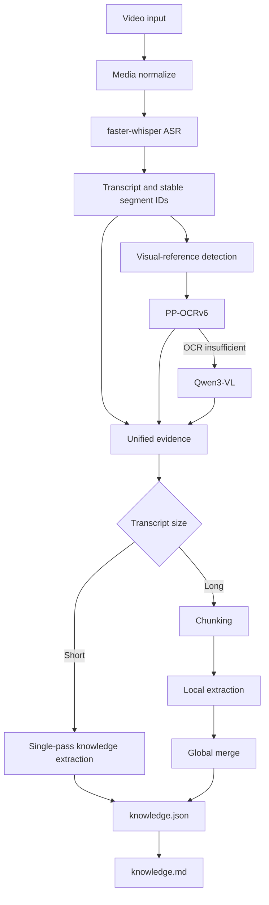

# Local Video Knowledge

> A local-first pipeline that turns videos into structured, traceable knowledge using ASR, selective OCR/VLM, and evidence-grounded LLM extraction.

本地优先的视频知识摄取系统：利用 ASR、选择性 OCR/VLM 与基于证据的大模型提取，将视频转换为结构化、可追溯的知识资产。

## Why

Video summaries often lose where a statement came from, omit important screen
content, and flatten opinion into fact. This project retains transcript segment
IDs, video time ranges, visual evidence, and source provenance so a knowledge
point can be traced back to the original media.

## Features

- Media normalization for complete files and reliably paired separate A/V streams
- `faster-whisper` ASR with stable segment IDs and resumable checkpoints
- Evidence-grounded JSON knowledge extraction and programmatic Markdown rendering
- Long-transcript chunking followed by hierarchical knowledge merge
- Selective visual-reference detection, PP-OCRv6 OCR, and on-demand VLM fallback
- Program-owned timestamps/provenance; LLMs select evidence but do not invent it
- Explicit GPU model lifecycle management for ASR, OCR, VLM, and Knowledge models

Not implemented: automatic favorites ingestion, NAS workflow, RAG/embedding,
fact verification, source trust scoring, and a web UI.

## Architecture



## Core design

- **Evidence-first** — every extracted point cites existing transcript segment IDs;
  timestamps and quoted text are filled by Python.
- **Local-first** — ASR, OCR and LLM/VLM calls run locally. Model weights and
  private media are never part of this repository.
- **Selective vision** — OCR runs only around narrated visual references; VLM is
  loaded only when OCR cannot answer a relationship, trend, structure, or comparison.
- **Transcript chunking, not video splitting** — long videos are chunked after ASR,
  preserving one authoritative media timeline.

## Evidence model

Knowledge points are intentionally not treated as externally verified facts:

- `author_claim`: something the speaker presents as factual
- `author_opinion`: a judgement, recommendation, prediction, or personal experience
- `verification_question`: a question triggered by the content that needs later checking

All begin with `verification_status: "not_checked"`. VLM confidence is a model
self-assessment, not independent verification.

See synthetic, non-video examples in [`examples/`](examples/).

## Installation

Current validation target is Windows with an NVIDIA GPU, but an RTX 4090 is not
required. CPU configurations are possible and slower.

1. Install Python 3.10+, FFmpeg (including `ffprobe`), and put both on `PATH`.
2. Create the main environment:

   ```powershell
   .\scripts\setup.ps1
   ```

3. Create local configuration:

   ```powershell
   Copy-Item config\config.example.json config\config.json
   ```

   Edit model identifiers and hardware choices in `config/config.json`.

4. Optional GPU OCR uses a second environment. Install the Paddle GPU wheel
   matching your OS/CUDA according to PaddlePaddle's installation guide, then:

   ```powershell
   python -m venv .venv-paddle-gpu
   .\.venv-paddle-gpu\Scripts\python.exe -m pip install -r requirements-paddle-gpu.txt
   ```

5. Optional local LLM/VLM integration uses LM Studio. Install its CLI so `lms`
   is on `PATH`, load locally downloaded models, then set their model key and API
   identifier in your private config.

CUDA/cuDNN runtime DLLs, FFmpeg binaries, Paddle model caches, and model weights
are deliberately not included. See [`runtime/README.md`](runtime/README.md).

## Validated model combination

- ASR: `faster-whisper large-v3`
- OCR: PP-OCRv6 medium
- VLM fallback: Qwen3-VL-8B-Instruct Q4_K_M via LM Studio
- Knowledge extraction: Qwen3.6-27B via LM Studio

These are examples, not bundled dependencies or mandatory model choices.

## LLM and VLM backends

Both Knowledge extraction and selective VLM fallback support the standard
OpenAI-compatible `POST /v1/chat/completions` interface. No vendor SDK is used.

Local LM Studio through the generic interface:

```json
{
  "backend": "openai_compatible",
  "base_url": "http://127.0.0.1:1234/v1",
  "model": "LOCAL_MODEL_IDENTIFIER",
  "api_key_env": null
}
```

Remote OpenAI-compatible API:

```json
{
  "backend": "openai_compatible",
  "base_url": "https://example.com/v1",
  "model": "MODEL_NAME",
  "api_key_env": "VIDEO_KNOWLEDGE_API_KEY"
}
```

Set the key in your shell (or load your local, ignored `.env` with your shell or
environment tool). The application itself reads only the named process
environment variable; a key is never stored in configuration, provenance, logs,
or source code. The legacy `lm_studio` backend remains
available when you want its explicit local load/unload lifecycle management.

## Usage

Place a complete video, or a paired video/audio stream set, under `data/incoming/manual`:

```powershell
.\.venv\Scripts\python.exe main.py
```

Or process one file directly:

```powershell
.\.venv\Scripts\python.exe main.py --input path\to\video.mp4
```

Use `--force` only when deliberately re-running completed stages. The pipeline
records state and fingerprints to avoid repeating completed media, ASR, or
Knowledge work unnecessarily.

## Tests

For contributors, install `requirements-dev.txt` after the main requirements,
then run:

```powershell
python -m pytest -q
```

## Output structure

```text
<video_id>/
├── originals/
├── normalized/
│   └── source.mp4
├── transcript.json
├── transcript.md
├── visual/
├── knowledge_chunks/
├── knowledge.json
├── knowledge.md
├── media.json
├── metadata.json
└── processing.json
```

`normalized/source.mp4` is the authoritative A/V source. Original files are
preserved locally; stream-copy muxing never re-encodes the video.

## Provenance

The schema can record `douyin`, `bilibili`, `youtube`, or `other` as a source
platform. It does not yet assess platform credibility or verify claims. Never
commit browser cookies, private URLs, downloaded media, or generated output.

## Roadmap

- Favorites ingestion for supported platforms
- Bilibili and YouTube ingestion
- NAS storage workflow
- Semantic search / RAG
- Cross-video knowledge merge
- Fact verification and source assessment

## Limitations

- Primarily validated on Windows + NVIDIA GPU
- Downloader support is not part of the public release workflow
- Visual-reference detection can miss relevant frames
- Long-video token estimation is heuristic
- Local model quality directly affects extraction quality

## License

MIT. See [LICENSE](LICENSE).
