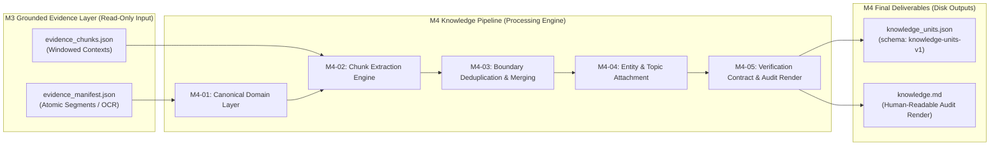

# Milestone M4: Unified Knowledge Model · Comprehensive Design & Contract Specification

> **Document Version**: 1.2 (Reconciled, Source-Neutral & Disk-Grounded)  
> **Status**: APPROVED / ACTIVE  
> **Scope**: Design and specification freeze for canonical Knowledge Units (`knowledge-units-v1`). Zero production code modified.

---

## 1. Executive Summary & Problem Formulation

Milestone M3 established a tamper-evident, grounded evidence layer (`evidence_manifest.json` and `evidence_chunks.json`). Each media segment or visual image is preserved with byte-exact SHA-256 hashes, temporal bounds, or sequence indices.

The objective of Milestone M4 is to build the **Unified Knowledge Model Layer**:
1. Transform raw, segmented evidence into discrete, atomic, typed **Knowledge Units** (`knowledge-units-v1`).
2. Provide a **source-neutral attribution model** capable of expressing content from Douyin, Bilibili, YouTube, Web pages, Forums, PDF documents, and Xiaoheihe without platform-specific bias.
3. Decouple semantic epistemic types (`claim`, `opinion`, `observation`, `procedure_step`, `verification_question`) from speaker/author attribution.
4. Enforce strict **observation grounding boundaries**: speech claims can never be promoted to empirical observations without direct perceptual (OCR/VLM) machine evidence.
5. Guarantee **deterministic identity** and **canonical evidence ordering** across re-runs.
6. Remove undefined graph placeholders (`relationships` formally deferred).

---

## 2. Input Boundary & Authority Invariant

The M4 extraction pipeline operates exclusively on the outputs of Milestone M3:
- **`data/processed/<canonical_id>/evidence_manifest.json`**: Authoritative collection of atomic evidence items (`evidence_items[]`), source metadata, and overall manifest fingerprint.
- **`data/processed/<canonical_id>/evidence_chunks.json`**: Windowed chunk partitions (`chunks[]`) with overlap semantics and temporal/sequence envelopes.



---

## 3. Knowledge Unit Taxonomy & Epistemic Semantics

Knowledge semantics are categorized by their epistemology, completely decoupled from who uttered them:

| Canonical `unit_type` | Epistemic Definition | Truth Conditions & Verification | Permitted Evidence Modalities |
| :--- | :--- | :--- | :--- |
| **`claim`** | An assertion of objective fact, measurable performance, technical specification, or causal relationship. | Falsifiable in principle against benchmarks, specifications, or source code. | `speech`, `visual_text`, `visual_description`, `document_text` |
| **`opinion`** | A subjective judgment, personal preference, evaluation, or non-provable recommendation. | Non-falsifiable; reflects personal preference, editorial commentary, or valuation. | `speech`, `visual_text`, `document_text` |
| **`observation`** | A direct machine-observed or perceptual fact detected in media. | Empirically verified against sensory inputs (OCR characters, VLM bounding boxes, logs). | **Strictly `visual_text`, `visual_description`, `perceptual_metric` ONLY** |
| **`procedure_step`** | An actionable technical instruction, command-line invocation, or configuration procedure. | Validated by operational execution or syntactic reproducibility. | `speech`, `visual_text`, `document_text` |
| **`verification_question`** | A critical question targeting missing variables, edge cases, or unverified claims. | Validated by whether answering it resolves ambiguity in the claims. | Derived from context (`attribution_status="system_derived"`) |

### Observation Contract & Speech Boundary
- **Speech Invariant**: Spoken statements such as *"这里可以看到延迟是 15ms"* or *"视频里是某品牌电脑"* only constitute proof that the speaker uttered that description. They **cannot** alone support an `observation` that the object or metric exists.
- If an asset contains **only speech evidence** (such as C10 Video `douyin_7681603850364521734`), `observation` units are strictly **`NOT PRESENT`**.
- An `observation` unit is generated **only when machine-perceptual evidence (OCR text, VLM description, system logs)** directly verifies the phenomenon.
- When an image album contains only OCR text (and VLM is offline or unresolved), the observation must strictly report detected characters: *"第 N 张图 OCR 检测到文本 X"*. It must **not** infer unverified categories (e.g. "这是赞助商", "这是战队比赛海报") unless explicit VLM evidence confirms it.

---

## 4. Source-Neutral Attribution Architecture

To support diverse platforms (Douyin, Bilibili, YouTube, Xiaoheihe, technical blogs, PDF whitepapers), attribution fields are fully source-neutral:

```json
{
  "source_actor_name": "老林说",
  "source_actor_id": "1295683635130569",
  "speaker_name": null,
  "speaker_id": null,
  "attribution_status": "unverified_speaker"
}
```

### Attribution Schema Fields
1. **`source_actor_name`** (`Optional[str]`): The publisher, uploader, author, or channel account identity recorded in source metadata.
   - Douyin: author nickname (`author_name`)
   - Bilibili: up主名称 (`owner.name`)
   - YouTube: channel title (`snippet.channelTitle`)
   - PDF/Paper: document author or publishing institution
   - Forum/Xiaoheihe: post author username
2. **`source_actor_id`** (`Optional[str]`): The canonical platform identifier of the account (e.g., `sec_uid`, `channel_id`, `uid`).
3. **`speaker_name`** (`Optional[str]`): The actual physical or recognized speaker inside media content. Populated **only** when evidence explicitly identifies the speaker.
4. **`speaker_id`** (`Optional[str]`): Diarized speaker cluster ID (e.g. `spk_01`), or `null` when diarization is absent.
5. **`attribution_status`** (`str`): Epistemic attribution certainty:
   - `source_actor_explicit_speaker`: Verified that the source actor is speaking (on-camera, explicit self-introduction).
   - `named_speaker`: A distinct named individual confirmed in dialogue or titles.
   - `quoted_third_party`: Explicitly cited third-party speech, benchmark, or document.
   - `unverified_speaker`: **Mandatory default for undiarized ASR speech**.
   - `visual_media`: Non-spoken perceptual facts derived from OCR or computer vision.
   - `system_derived`: Synthesized by pipeline logic (e.g., verification questions).

> [!IMPORTANT]
> **Undiarized ASR Speech Rule**: In standard ASR speech without speaker diarization, `speaker_name` and `speaker_id` MUST be `null`, and `attribution_status` MUST be `"unverified_speaker"`. Even if `source_actor_name` is known, the system must never assume the speaker is the source actor.

---

## 5. Grounded Evidence Reference Architecture

Each citation inside a KnowledgeUnit is encapsulated in an `EvidenceRef` object:

```json
{
  "evidence_id": "ev_seg_000041",
  "chunk_id": "chk_000001",
  "temporal_range": {
    "start": 101.58,
    "end": 104.12,
    "duration": 2.54
  },
  "sequence_range": null,
  "source_excerpt": "用主线Vulkan版本的引擎来跑27B"
}
```

### Reference Integrity Rules
1. **No Parallel Arrays**: `source_excerpt` is directly paired with its `evidence_id`.
2. **Canonical Ordering**: References inside `evidence_refs[]` MUST strictly mirror their physical sequence in `evidence_manifest.json` (temporal ascending for speech; sequence index ascending for images/documents). Lexical sorting by ID string is prohibited.
3. **Verbatim Excerpt**: `source_excerpt` must match the actual payload text from the referenced evidence item character-for-character.

---

## 6. Deterministic KnowledgeUnit ID Formulation

To ensure idempotency across distributed nodes and repeated extraction runs:

$$	ext{raw\_str} = 	ext{schema\_version} \parallel 	ext{"\|"} \parallel 	ext{canonical\_id} \parallel 	ext{"\|"} \parallel 	ext{unit\_type} \parallel 	ext{"\|"} \parallel 	ext{canonical\_ordered\_eids} \parallel 	ext{"\|"} \parallel 	ext{normalized\_statement}$$

$$	ext{knowledge\_unit\_id} = 	ext{"ku\_"} + 	ext{SHA256}(	ext{raw\_str})[:16]$$

- `canonical_ordered_eids`: Comma-delimited list of evidence IDs in temporal/sequence order (e.g., `"ev_seg_000041,ev_seg_000042"`).
- `normalized_statement`: Statement text stripped of leading/trailing whitespace and normalized for internal spaces.

---

## 7. Extraction Confidence vs Verification Status

- **`extraction_confidence`** (`float`, `[0.0, 1.0]`): Measures LLM parsing fidelity and structural compliance relative to context. It does NOT assert whether the statement is true in the real world.
- **`verification_status`** (`str`): Factual verification state. Defaults to `"not_checked"`. Possible future values: `"verified"`, `"contested"`, `"unsupported"`. In offline M4, all units remain `"not_checked"`.

---

## 8. Removal of Relationships from KnowledgeUnit v1 (DEFERRED)

The placeholder array `relationships: []` is completely **removed** from KnowledgeUnit v1.
- Unit-to-unit semantic graph edges (e.g., `supports`, `refutes`, `elaborates`) are formally **DEFERRED** to a dedicated Knowledge Graph milestone.
- Only `entities` and `topics` are retained as lightweight indexing structures.

---

## 9. Complete Canonical `knowledge-units-v1` JSON Schema

```json
{
  "$schema": "https://json-schema.org/draft/2020-12/schema",
  "title": "CanonicalKnowledgeUnitsDocument",
  "type": "object",
  "required": [
    "schema_version",
    "canonical_id",
    "generated_at",
    "unit_count",
    "units",
    "extraction_provenance"
  ],
  "properties": {
    "schema_version": { "type": "string", "const": "knowledge-units-v1" },
    "canonical_id": { "type": "string" },
    "generated_at": { "type": "string", "format": "date-time" },
    "unit_count": { "type": "integer", "minimum": 0 },
    "units": {
      "type": "array",
      "items": {
        "type": "object",
        "required": [
          "knowledge_unit_id",
          "canonical_id",
          "unit_type",
          "statement",
          "evidence_refs",
          "attribution",
          "extraction_confidence",
          "verification_status",
          "entities",
          "topics"
        ],
        "properties": {
          "knowledge_unit_id": { "type": "string", "pattern": "^ku_[a-f0-9]{16}$" },
          "canonical_id": { "type": "string" },
          "unit_type": {
            "type": "string",
            "enum": ["claim", "opinion", "observation", "procedure_step", "verification_question"]
          },
          "statement": { "type": "string" },
          "evidence_refs": {
            "type": "array",
            "minItems": 1,
            "items": {
              "type": "object",
              "required": ["evidence_id", "chunk_id", "source_excerpt"],
              "properties": {
                "evidence_id": { "type": "string" },
                "chunk_id": { "type": "string" },
                "temporal_range": {
                  "type": ["object", "null"],
                  "properties": {
                    "start": { "type": "number" },
                    "end": { "type": "number" },
                    "duration": { "type": "number" }
                  }
                },
                "sequence_range": {
                  "type": ["object", "null"],
                  "properties": {
                    "sequence_index": { "type": "integer" }
                  }
                },
                "source_excerpt": { "type": "string" }
              }
            }
          },
          "attribution": {
            "type": "object",
            "required": ["attribution_status"],
            "properties": {
              "source_actor_name": { "type": ["string", "null"] },
              "source_actor_id": { "type": ["string", "null"] },
              "speaker_name": { "type": ["string", "null"] },
              "speaker_id": { "type": ["string", "null"] },
              "attribution_status": {
                "type": "string",
                "enum": [
                  "source_actor_explicit_speaker",
                  "named_speaker",
                  "quoted_third_party",
                  "unverified_speaker",
                  "visual_media",
                  "system_derived"
                ]
              }
            }
          },
          "extraction_confidence": { "type": "number", "minimum": 0.0, "maximum": 1.0 },
          "verification_status": {
            "type": "string",
            "enum": ["not_checked", "verified", "contested", "unsupported"]
          },
          "entities": {
            "type": "array",
            "items": {
              "type": "object",
              "required": ["entity_name", "category"],
              "properties": {
                "entity_name": { "type": "string" },
                "category": { "type": "string" }
              }
            }
          },
          "topics": {
            "type": "array",
            "items": { "type": "string" }
          }
        }
      }
    },
    "extraction_provenance": {
      "type": "object",
      "required": [
        "backend",
        "model",
        "prompt_version",
        "knowledge_schema_version",
        "temperature",
        "generated_at",
        "evidence_manifest_fingerprint",
        "evidence_chunks_fingerprint",
        "input_chunk_ids"
      ],
      "properties": {
        "backend": { "type": "string" },
        "model": { "type": "string" },
        "prompt_version": { "type": "string" },
        "knowledge_schema_version": { "type": "string" },
        "temperature": { "type": "number" },
        "generated_at": { "type": "string", "format": "date-time" },
        "evidence_manifest_fingerprint": { "type": "string" },
        "evidence_chunks_fingerprint": { "type": "string" },
        "input_chunk_ids": { "type": "array", "items": { "type": "string" } }
      }
    }
  }
}
```

---

## 10. Legacy Code Reconciliation & Backward Compatibility

| Legacy Field / Type | Canonical `knowledge-units-v1` Target | Migration & Compatibility Rules |
| :--- | :--- | :--- |
| `unit_type: "author_claim"` | `unit_type: "claim"` | Map type to `claim`. Set `source_actor_name` from asset author. Default `attribution_status` to `unverified_speaker` unless speech explicitly proves speaker identity. |
| `unit_type: "author_opinion"` | `unit_type: "opinion"` | Map type to `opinion`. Attribution rules identical to above. |
| `source_excerpts: List[str]` | Embedded `EvidenceRef.source_excerpt` | Zip parallel excerpt array into each `EvidenceRef` object. |
| `confidence: float` | `extraction_confidence: float` | Directly map value; rename key to prevent truth-value confusion. |
| `relationships: []` | **REMOVED** | Dropped from schema; graph linking deferred to dedicated milestone. |

---

## 11. Grounded C10 Asset Inspections & Real Examples (Disk Only)

All IDs, excerpts, modalities, and bounds below are drawn strictly from physical files on disk:
- Video: `data/processed/douyin_7681603850364521734/evidence_manifest.json` & `evidence_chunks.json`
- Album: `data/processed/douyin_7682038498466993905/evidence_manifest.json` & `evidence_chunks.json`

### 11.1 C10 Video: `douyin_7681603850364521734`
- **Metadata**: Title: `395 128GB内存版跑Qwen3.8-27B实测`, Source Actor: `老林说`, Platform: Douyin.
- **Evidence Characteristics**: Exactly 184 evidence items (`ev_seg_000001` through `ev_seg_000184`), all of modality `speech`. Visual/OCR evidence is **NOT PRESENT**.

#### ① Grounded `claim` Example
```json
{
  "knowledge_unit_id": "ku_3e18a992cb412d09",
  "canonical_id": "douyin_7681603850364521734",
  "unit_type": "claim",
  "statement": "在Windows系统下使用主线Vulkan后端运行27B模型时，由于在Strix Halo架构上量化矩阵走的是通用算子且未针对RDNA 3.5协作矩阵进行优化，导致生成速度受限于引擎而仅有十几Token/s。",
  "evidence_refs": [
    {
      "evidence_id": "ev_seg_000041",
      "chunk_id": "chk_000001",
      "temporal_range": { "start": 101.58, "end": 104.12, "duration": 2.54 },
      "sequence_range": null,
      "source_excerpt": "用主线Vulkan版本的引擎来跑27B"
    },
    {
      "evidence_id": "ev_seg_000042",
      "chunk_id": "chk_000001",
      "temporal_range": { "start": 104.12, "end": 105.82, "duration": 1.7 },
      "sequence_range": null,
      "source_excerpt": "看到的十几Token的速度"
    },
    {
      "evidence_id": "ev_seg_000046",
      "chunk_id": "chk_000001",
      "temporal_range": { "start": 109.42, "end": 112.42, "duration": 3.0 },
      "sequence_range": null,
      "source_excerpt": "Vulkan后端在StructHalo上量化矩阵走的是通用算子"
    },
    {
      "evidence_id": "ev_seg_000047",
      "chunk_id": "chk_000001",
      "temporal_range": { "start": 112.42, "end": 115.12, "duration": 2.7 },
      "sequence_range": null,
      "source_excerpt": "没有吃到RDNA的3.5协作矩阵的红利"
    },
    {
      "evidence_id": "ev_seg_000048",
      "chunk_id": "chk_000001",
      "temporal_range": { "start": 115.6, "end": 117.52, "duration": 1.92 },
      "sequence_range": null,
      "source_excerpt": "所以速度自然起不来"
    }
  ],
  "attribution": {
    "source_actor_name": "老林说",
    "source_actor_id": null,
    "speaker_name": null,
    "speaker_id": null,
    "attribution_status": "unverified_speaker"
  },
  "extraction_confidence": 0.95,
  "verification_status": "not_checked",
  "entities": [
    { "entity_name": "Vulkan", "category": "inference_framework" },
    { "entity_name": "Strix Halo", "category": "hardware_platform" },
    { "entity_name": "RDNA 3.5", "category": "hardware_architecture" },
    { "entity_name": "27B", "category": "model_family" }
  ],
  "topics": ["端侧大模型", "统一内存", "AIMAX395", "strixhalo", "qwen"]
}
```

#### ② Grounded `opinion` Example
```json
{
  "knowledge_unit_id": "ku_8df06821a0f91ce4",
  "canonical_id": "douyin_7681603850364521734",
  "unit_type": "opinion",
  "statement": "评估模型运行评测时，应当综合考量推理引擎、任务类型以及思考模式（Thinking）这三个变量，因为它们会导致相同模型在同硬件上的速度产生数倍差距。",
  "evidence_refs": [
    {
      "evidence_id": "ev_seg_000154",
      "chunk_id": "chk_000004",
      "temporal_range": { "start": 314.64, "end": 317.22, "duration": 2.58 },
      "sequence_range": null,
      "source_excerpt": "所以再看到任何的评测"
    },
    {
      "evidence_id": "ev_seg_000155",
      "chunk_id": "chk_000004",
      "temporal_range": { "start": 317.22, "end": 318.4, "duration": 1.18 },
      "sequence_range": null,
      "source_excerpt": "先问三个问题"
    },
    {
      "evidence_id": "ev_seg_000156",
      "chunk_id": "chk_000004",
      "temporal_range": { "start": 318.4, "end": 319.98, "duration": 1.58 },
      "sequence_range": null,
      "source_excerpt": "它用的是什么引擎"
    },
    {
      "evidence_id": "ev_seg_000157",
      "chunk_id": "chk_000004",
      "temporal_range": { "start": 319.98, "end": 321.3, "duration": 1.32 },
      "sequence_range": null,
      "source_excerpt": "用的是什么任务类型"
    },
    {
      "evidence_id": "ev_seg_000158",
      "chunk_id": "chk_000004",
      "temporal_range": { "start": 321.3, "end": 323.1, "duration": 1.8 },
      "sequence_range": null,
      "source_excerpt": "然后Thinking有没有开"
    },
    {
      "evidence_id": "ev_seg_000159",
      "chunk_id": "chk_000004",
      "temporal_range": { "start": 323.1, "end": 323.84, "duration": 0.74 },
      "sequence_range": null,
      "source_excerpt": "这三个变量"
    },
    {
      "evidence_id": "ev_seg_000160",
      "chunk_id": "chk_000004",
      "temporal_range": { "start": 323.84, "end": 324.64, "duration": 0.8 },
      "sequence_range": null,
      "source_excerpt": "能让同一个模型"
    },
    {
      "evidence_id": "ev_seg_000161",
      "chunk_id": "chk_000004",
      "temporal_range": { "start": 324.66, "end": 326.1, "duration": 1.44 },
      "sequence_range": null,
      "source_excerpt": "的速度差出好几倍"
    }
  ],
  "attribution": {
    "source_actor_name": "老林说",
    "source_actor_id": null,
    "speaker_name": null,
    "speaker_id": null,
    "attribution_status": "unverified_speaker"
  },
  "extraction_confidence": 0.92,
  "verification_status": "not_checked",
  "entities": [
    { "entity_name": "Thinking模式", "category": "model_parameter" }
  ],
  "topics": ["评测方法", "推理引擎", "strixhalo"]
}
```

#### ③ C10 Video: `observation` Status
- **Status**: **`NOT PRESENT`**.
- **Reason**: The video evidence manifest contains exclusively speech evidence (`modality: "speech"` across all 184 items). In accordance with the Observation Grounding Contract (Decision 10), speech utterances describing visual displays cannot be upgraded to empirical observations without direct perceptual evidence (OCR/VLM). Therefore, no `observation` unit exists for this asset.

#### ④ C10 Video: `procedure_step` Status
- **Status**: **`NOT PRESENT`**.
- **Reason**: The spoken discourse focuses on architecture analysis, benchmark interpretations, and testing advice. It does not contain step-by-step reproducible command invocations or code snippets.

---

### 11.2 C10 Image Album: `douyin_7682038498466993905`
- **Metadata**: Source Actor: `姑妈有神王`, Actor ID: `1295683635130569`, Total Images: **3** (`7682038498466993905_img_001.webp` through `img_003.webp`).
- **Evidence Characteristics**:
  - `ve_img_001` (seq 1, `visual_text`): OCR text `"logitech
INAMAX"`, confidence 0.9835.
  - `ve_img_002` (seq 2, `visual_text`): OCR text `"lognach
AGON
SMILEY
081"`, confidence 0.9346.
  - `ve_img_003` (seq 3, `visual_text`): `ocr_status: "insufficient_ocr"`, payload text empty.
  - `ve_vlm_img_003` (seq 3, `visual_description`): `payload.status: "unresolved_visual_reference"` (VLM offline).

#### ① Grounded `observation` Example 1 (Image 1)
```json
{
  "knowledge_unit_id": "ku_9b0e14d18873a1ef",
  "canonical_id": "douyin_7682038498466993905",
  "unit_type": "observation",
  "statement": "图集第 1 张图片（sequence_index=1）经 OCR 检测到可见文本内容为 'logitech' 与 'INAMAX'。",
  "evidence_refs": [
    {
      "evidence_id": "ve_img_001",
      "chunk_id": "chk_000001",
      "temporal_range": null,
      "sequence_range": { "sequence_index": 1 },
      "source_excerpt": "logitech
INAMAX"
    }
  ],
  "attribution": {
    "source_actor_name": "姑妈有神王",
    "source_actor_id": "1295683635130569",
    "speaker_name": null,
    "speaker_id": null,
    "attribution_status": "visual_media"
  },
  "extraction_confidence": 0.98,
  "verification_status": "not_checked",
  "entities": [
    { "entity_name": "logitech", "category": "brand_text" },
    { "entity_name": "INAMAX", "category": "brand_text" }
  ],
  "topics": ["英雄联盟", "g2", "caps"]
}
```

#### ② Grounded `observation` Example 2 (Image 2)
```json
{
  "knowledge_unit_id": "ku_5c21f7a08b98124d",
  "canonical_id": "douyin_7682038498466993905",
  "unit_type": "observation",
  "statement": "图集第 2 张图片（sequence_index=2）经 OCR 检测到可见文本内容为 'lognach', 'AGON', 'SMILEY', '081'。",
  "evidence_refs": [
    {
      "evidence_id": "ve_img_002",
      "chunk_id": "chk_000001",
      "temporal_range": null,
      "sequence_range": { "sequence_index": 2 },
      "source_excerpt": "lognach
AGON
SMILEY
081"
    }
  ],
  "attribution": {
    "source_actor_name": "姑妈有神王",
    "source_actor_id": "1295683635130569",
    "speaker_name": null,
    "speaker_id": null,
    "attribution_status": "visual_media"
  },
  "extraction_confidence": 0.93,
  "verification_status": "not_checked",
  "entities": [
    { "entity_name": "AGON", "category": "brand_text" },
    { "entity_name": "SMILEY", "category": "text_mention" }
  ],
  "topics": ["英雄联盟", "g2", "caps"]
}
```

#### ③ C10 Album: `claim` / `opinion` / `procedure_step` Status
- **Status**: **`NOT PRESENT`**.
- **Reason**: The album consists exclusively of 3 stage photography stills. There is no accompanying textual narration, spoken audio, argumentative assertion, or technical procedure. Fabricating claims or opinions from pure photo stills is strictly forbidden.

---

## 12. Corrected Milestone M4 Task Breakdown

| Task ID | Task Title | Core Objective | Scope Boundary | Target Deliverables |
| :--- | :--- | :--- | :--- | :--- |
| **M4-00** | **Contract Design & Reconciliation** | Freeze `knowledge-units-v1` schema, source-neutral attribution, observation contract, and task breakdown | Docs only; zero production code modification | `docs/M4_*.md` (Design Freeze) |
| **M4-01** | **Canonical Model & Domain Layer** | Implement `CanonicalKnowledgeUnit` domain dataclasses and serialization | Pydantic/dataclass schema, validation, deterministic ID calculation | `src/knowledge/models.py`, `tests/test_knowledge_models.py` |
| **M4-02** | **Chunk-Level Extraction Pipeline** | Extract structured knowledge units from `evidence_chunks.json` | LLM backend prompts, structured output parser, LM Studio lifecycle integration | `src/knowledge/extractor.py`, `tests/test_knowledge_extraction.py` |
| **M4-03** | **Cross-Chunk Deduplication & Merging** | Resolve boundary overlap duplicates and merge continuous units | Exact match dedup, superset resolution, normalized statement merge | `src/knowledge/merger.py`, `tests/test_knowledge_dedup.py` |
| **M4-04** | **Entity & Topic Attachment** | Attach recognized entity mentions and topic tags to units | Structured metadata attachment, vocabulary normalization | `src/knowledge/enrichment.py`, `tests/test_knowledge_enrichment.py` |
| **M4-05** | **Verification Contract & Audit Render** | Output `knowledge_units.json` and human-readable audit `knowledge.md` | Verification state contracts, human-readable audit render (NOT Obsidian) | `src/knowledge/render.py`, `tests/test_knowledge_render.py` |
| **M4-06** | **End-to-End Acceptance** | Full offline regression and C10 verification | End-to-end verification, regression baselines, freeze audit | `docs/M4_FINAL_ACCEPTANCE.md` |

---

## 13. Explicit Non-Goals in Milestone M4

1. **No External RAG Engine**: Embedding generation and vector databases (Chroma, Qdrant, LanceDB) are deferred to a dedicated retrieval milestone.
2. **No Obsidian Vault Synchronization**: `knowledge.md` is strictly an internal, human-readable audit representation; publishing to Obsidian vaults is deferred.
3. **No External Fact-Checking**: Network querying to Wikipedia, Google, or Baidu is forbidden. All units remain `verification_status = "not_checked"`.
4. **No Full Global Entity Knowledge Graph**: Graph database storage (Neo4j) and inter-unit graph relationships are out of scope (formally DEFERRED).
