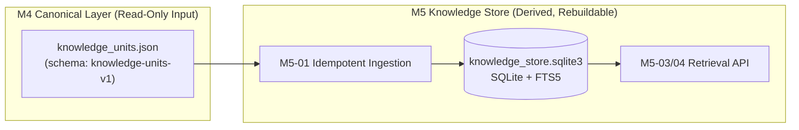

# Milestone M5: Knowledge Store & Retrieval Foundation · Comprehensive Design & Contract Specification

> **Document Version**: 1.0
> **Status**: APPROVED / ACTIVE (M5-00 Design Freeze)
> **Scope**: Design and specification freeze for the M5 Knowledge Store (`knowledge-store-v1`) and the retrieval contract. Zero production code modified in M5-00.

---

## 1. Executive Summary & Problem Formulation

Milestone M4 produced the canonical, immutable `knowledge_units.json` artifacts
(schema `knowledge-units-v1`) for every processed asset. These artifacts are
human-auditable JSON documents stored per-asset under
`data/processed/<canonical_id>/knowledge/`.

Milestone M5 introduces the **Knowledge Store & Retrieval Foundation**: a local,
queryable, rebuildable store that lets an Agent search across all assets at once
and retrieve Knowledge Units together with full provenance (evidence refs,
attribution, lineage, source artifact reference).

M5 strictly separates two layers:

1. **Canonical Knowledge Source of Truth** = the frozen M4 `knowledge_units.json`
   artifact (immutable, authoritative, human-auditable).
2. **Knowledge Store** = a derived / rebuildable retrieval store projected from
   the canonical artifacts.

### Source-of-Truth Invariant

```text
M4 knowledge_units.json  ==  Canonical Knowledge Source of Truth
M5 Knowledge Store       ==  Derived / Rebuildable Retrieval Store
```

- The Knowledge Store **can be deleted and fully rebuilt** from the M4
  `knowledge_units.json` artifacts.
- The Knowledge Store has **no authority to modify** the semantic content of a
  `CanonicalKnowledgeUnit`: it must never rewrite `statement`, change
  `verification_status`, change `attribution`, change `evidence`, or regenerate
  a KU ID.
- Store rows are a **projection**; the canonical unit payload (verbatim) is
  always carried inside the store so that a `RetrievalHit` can return the
  complete immutable unit.

---

## 2. Input Boundary & Authority Invariant

The M5 ingestion pipeline consumes **only** the M4 final artifacts:

- `data/processed/<canonical_id>/knowledge/knowledge_units.json`
  (schema `knowledge-units-v1`, `CanonicalKnowledgeUnitsDocument`)

M5 never re-reads M3 evidence, never re-runs M2/M3/M4 pipelines, never invokes an
LLM, and never touches network endpoints. Ingestion is deterministic and offline.



---

## 3. Store Location & Data Layout

### 3.1 Stable Path

```text
data/knowledge/knowledge_store.sqlite3
```

- Rationale:
  - The store is **cross-asset**; it must not live inside
    `data/processed/<single asset>/`.
  - The store is a **derived artifact**, not a source archive; `data/` is the
    correct root because `data/*` (and `*.sqlite3*`) are already gitignored.
  - The canonical artifacts remain the authoritative source; the DB is
    rebuildable from them at any time.
- Future (M5-06+): a store manifest sidecar
  `data/knowledge/knowledge_store_manifest.json` may record store-level metadata
  (schema version, revision, ingested asset list). The DB itself remains the
  primary artifact.

### 3.2 Derived Artifact Semantics

```text
deleting data/knowledge/knowledge_store.sqlite3  ==  deleting the derived store
deleting data/processed/<canonical_id>/knowledge_units.json  ==  NEVER happens from M5
```

`rebuild_store()` can recreate the entire store by scanning the canonical
artifacts (see §10).

---

## 4. Storage Technology Decision

### 4.1 M5 v1 Freezes **SQLite**

Selected for:

| Property | Rationale |
| :--- | :--- |
| **local-first** | Zero service, zero daemon, single file. |
| **Python stdlib** | `sqlite3` is built-in; no new dependency (repo already uses `sqlite3` in `src/collector/repository.py`, `src/downloader/job_store.py`, `src/media_adapter/adapter.py`). |
| **portable** | Single `.sqlite3` file is trivially copyable / backupable. |
| **NAS friendly** | File can live on a NAS share for single-writer backup; see §13. |
| **transactional** | ACID `BEGIN IMMEDIATE ... COMMIT/ROLLBACK` for atomic asset ingestion. |
| **FTS5** | SQLite's full-text search extension covers M5 lexical retrieval without external engines. |

### 4.2 Excluded (Deferred, Not Introduced in M5 v1)

PostgreSQL · Elasticsearch · Qdrant · Chroma · LanceDB. These are re-evaluated
only when scale or retrieval quality demands it (see §12, §14).

---

## 5. Database Versioning & Schema Policy

### 5.1 Store Schema Version

```text
store_schema_version = "knowledge-store-v1"
```

- Enforced via **SQLite `PRAGMA user_version`** (set to `1` for
  `knowledge-store-v1`).
- A `store_meta` table additionally records the human-readable schema string,
  schema policy version, creation time, and latest rebuild time.

### 5.2 Schema Policy (M5 v1)

M5 v1 supports exactly three operations:

| Operation | Behavior |
| :--- | :--- |
| `create_store` | Creates the schema from scratch on an empty / non-existent DB file. |
| `validate_store` | Confirms `PRAGMA user_version` and schema compatibility; raises on mismatch. |
| `rebuild_store` | Drops derived tables and re-ingests all discovered canonical assets. |

No complex migration engine is required in M5 v1. Compatibility rule:

- `user_version == 1` (knowledge-store-v1): usable.
- `user_version == 0` on an empty file: create.
- Any other `user_version` (or a file with incompatible tables): **explicit
  FAIL / instruct rebuild** — never silent guess, never partial migration.

---

## 6. Core Logical Store Model

Final table names follow `snake_case`, matching the repo's SQLite conventions.

### 6.1 `store_meta`

| Column | Type | Notes |
| :--- | :--- | :--- |
| `key` | TEXT PRIMARY KEY | e.g. `schema_version`, `schema_policy_version`, `created_at`, `rebuilt_at`, `store_revision` |
| `value` | TEXT | serialized metadata |

### 6.2 `ingested_assets`

Records which canonical artifact the store was built from, for each asset.

| Column | Type | Notes |
| :--- | :--- | :--- |
| `canonical_id` | TEXT PRIMARY KEY | e.g. `douyin_7681603850364521734` |
| `knowledge_schema_version` | TEXT NOT NULL | must equal `knowledge-units-v1` |
| `source_artifact_path` | TEXT NOT NULL | relative reference to the canonical artifact |
| `source_artifact_fingerprint` | TEXT NOT NULL | content fingerprint (see §9) |
| `ingested_at` | TEXT NOT NULL | ISO UTC timestamp |
| `unit_count` | INTEGER NOT NULL | number of units ingested for the asset |

Purpose: the store always knows which `knowledge_units.json` it was built from,
enabling idempotency and staleness detection.

### 6.3 `knowledge_units`

The normalized projection of one canonical unit. **The complete verbatim unit
payload is preserved** so the store can reconstruct a full canonical unit.

| Column | Type | Notes |
| :--- | :--- | :--- |
| `unit_rowid` | INTEGER PRIMARY KEY | internal integer key (used as FTS `content_rowid`) |
| `knowledge_unit_id` | TEXT NOT NULL UNIQUE | canonical identity, e.g. `ku_248cc82b07463eb4` |
| `canonical_id` | TEXT NOT NULL | asset id (FK to `ingested_assets`) |
| `unit_type` | TEXT NOT NULL | `claim` / `opinion` / `observation` / `procedure_step` / `verification_question` |
| `statement` | TEXT NOT NULL | verbatim normalized statement (projection of payload) |
| `verification_status` | TEXT NOT NULL | `not_checked` / `verified` / `contested` / `unsupported` |
| `extraction_confidence` | REAL NOT NULL | in `[0.0, 1.0]` |
| `canonical_payload_json` | TEXT NOT NULL | **verbatim canonical unit JSON** (authoritative inside the store) |

Indexes:

- `CREATE INDEX idx_knowledge_units_canonical ON knowledge_units(canonical_id)`
- `CREATE INDEX idx_knowledge_units_type ON knowledge_units(unit_type)`
- `CREATE INDEX idx_knowledge_units_verification ON knowledge_units(verification_status)`

### 6.4 `evidence_refs`

Preserves the canonical evidence order per unit.

| Column | Type | Notes |
| :--- | :--- | :--- |
| `ref_rowid` | INTEGER PRIMARY KEY | internal |
| `knowledge_unit_id` | TEXT NOT NULL | FK to `knowledge_units` |
| `ordinal` | INTEGER NOT NULL | 0-based canonical position in `evidence_refs[]` |
| `evidence_id` | TEXT NOT NULL | e.g. `ev_seg_000041` / `ve_img_001` |
| `source_excerpt` | TEXT NOT NULL | verbatim excerpt (projection of payload) |
| `temporal_start` | REAL NULL | `temporal_range.start` when present |
| `temporal_end` | REAL NULL | `temporal_range.end` when present |
| `temporal_duration` | REAL NULL | `temporal_range.duration` when present |
| `sequence_index` | INTEGER NULL | `sequence_range.sequence_index` when present |

Constraints:

- `UNIQUE(knowledge_unit_id, ordinal)` — evidence order is preserved and
  protected.
- Temporal and sequence coordinates are mutually exclusive per canonical schema
  (a ref has at most one coordinate type); validated at ingestion.

### 6.5 `entities`

| Column | Type | Notes |
| :--- | :--- | :--- |
| `entity_rowid` | INTEGER PRIMARY KEY | internal |
| `knowledge_unit_id` | TEXT NOT NULL | FK to `knowledge_units` |
| `ordinal` | INTEGER NOT NULL | 0-based canonical position in `entities[]` |
| `entity_name` | TEXT NOT NULL | verbatim surface |
| `category` | TEXT NOT NULL | bounded M4-04 category vocabulary |

Constraint: `UNIQUE(knowledge_unit_id, ordinal)`.

### 6.6 `topics`

| Column | Type | Notes |
| :--- | :--- | :--- |
| `topic_rowid` | INTEGER PRIMARY KEY | internal |
| `knowledge_unit_id` | TEXT NOT NULL | FK to `knowledge_units` |
| `ordinal` | INTEGER NOT NULL | 0-based canonical position in `topics[]` |
| `topic` | TEXT NOT NULL | verbatim topic label |

Constraint: `UNIQUE(knowledge_unit_id, ordinal)`.

### 6.7 Attribution & Lineage

**Deliberately NOT normalized** in M5 v1. `attribution` and `extraction_lineage`
remain inside `canonical_payload_json` and are surfaced verbatim through
`RetrievalHit`. Rationale: no retrieval filter targets attribution/lineage
fields in v1, and full canonical JSON avoids duplicated truth. If a future
milestone needs structured attribution filtering, a projection table can be
added via a schema bump.

---

## 7. Canonical Payload vs Projection — Single Truth Rule

To prevent two conflicting versions of truth inside the DB:

- **Authoritative (inside the store):** `knowledge_units.canonical_payload_json`
  — the verbatim unit dict from `knowledge_units.json`.
- **Projections:** every normalized column (`unit_type`, `statement`,
  `verification_status`, `extraction_confidence`, evidence/entity/topic rows)
  is **derived by parsing `canonical_payload_json`** at ingestion time, in a
  single pass. Projections are written *from* the canonical payload — never as
  independent input — so divergence is impossible by construction.
- At ingestion, `canonical_payload_json` is validated to deserialize through
  `CanonicalKnowledgeUnit.from_dict` (schema `knowledge-units-v1`), which is the
  same gate M4-05 used. Any payload that fails validation rejects the whole
  asset transaction.
- A `RetrievalHit` always returns the unit fields read from
  `canonical_payload_json` (not from loose projection columns), guaranteeing the
  Agent receives the exact canonical text.

---

## 8. Atomic Ingestion & Replace Semantics

### 8.1 `ingest_knowledge_document(...)`

Signature concept:

```text
ingest_knowledge_document(
    canonical_artifact: dict,          # parsed knowledge_units.json
    *,
    source_artifact_path: Path,        # where it was read from
) -> IngestResult
```

Semantics — **one canonical asset = one transaction**:

```text
BEGIN IMMEDIATE
  validate artifact (schema knowledge-units-v1, document-level + per-unit)
  compute source_artifact_fingerprint
  if fingerprint already recorded for canonical_id -> ROLLBACK; return cache-hit
  upsert into ingested_assets
  replace/upsert units (delete prior rows for canonical_id, then insert all)
  replace/upsert evidence_refs, entities, topics (per unit)
  refresh FTS5 index for the asset's units          # atomic with rows (see §11)
COMMIT
on any failure: ROLLBACK  -> no half-ingested asset remains
```

Failure leaves **zero** partial asset data: the transaction guarantees all or
nothing for units + evidence + entities + topics + FTS index.

### 8.2 Idempotency / NO-OP

- Same `canonical_id` + same `source_artifact_fingerprint` → **NO-OP / cache
  hit**. No duplicated KU, EvidenceRef, Entity, or Topic rows. The `ingested_at`
  timestamp is preserved (never rewritten on a cache hit).

### 8.3 Fingerprint Change → Deterministic Replace

- Same `canonical_id` but a **changed** `source_artifact_fingerprint` → the
  asset's derived rows are **deleted and re-inserted** inside the same
  transaction. Old KUs never linger.
- Replace semantics are deterministic: the new artifact fully defines the new
  projection.

### 8.4 Source Artifact Fingerprint

- `source_artifact_fingerprint` = canonical JSON SHA-256 of the complete
  `knowledge_units.json` document (same canonical-serialization rule used by M4
  fingerprint helpers: `sort_keys=True`, `ensure_ascii=False`,
  `separators=(",", ":")`).

---

## 9. Deletion Semantics

```text
remove_asset(canonical_id)
```

- Deletes **only** the derived rows for that asset in the M5 Store:
  FTS rows → units → evidence_refs → entities → topics → `ingested_assets` row.
- **Never** deletes `data/processed`, M4 artifacts, M3 evidence, or archive
  media. Store deletion ≠ source deletion.
- If the canonical artifact later reappears, a normal ingest rebuilds the
  asset's projection.

---

## 10. Store Rebuild

```text
rebuild_store(...)
```

- Destroys derived tables (`knowledge_units`, `evidence_refs`, `entities`,
  `topics`, FTS index, `ingested_assets`) and re-creates them.
- **Artifact discovery rule:** scan `data/processed/*/knowledge/knowledge_units.json`
  — every directory containing a document whose `schema_version ==
  knowledge-units-v1` and which deserializes via `CanonicalKnowledgeUnitsDocument`.
- **Schema validation behavior:** each discovered artifact is fully validated;
  invalid assets are recorded.
- **Invalid asset behavior (v1): fail-fast.** An invalid canonical artifact
  aborts the rebuild with an explicit error listing the offending asset. The
  store never silently skips an asset that would make the store silently
  incomplete. (A future version may add a documented `--skip-invalid` mode.)

---

## 11. Lexical Search Design (FTS5)

### 11.1 Index Content & Weighted Fields

M5 v1 indexes four fields as **independent weighted FTS5 columns**:

| FTS column | Content | Weight intent |
| :--- | :--- | :--- |
| `statement` | unit statement | **highest** — the knowledge statement is the primary match surface |
| `entity_names` | concatenated `entity_name`s (space-joined) | **medium** |
| `topics` | concatenated topic labels (space-joined) | **medium** |
| `evidence_excerpts` | concatenated `source_excerpt`s (space-joined) | **lowest** — matches evidence without letting long excerpts drown statement ranking |

### 11.2 Choice & Rationale (A vs B)

- **Option A (statement + entities + topics only)** was **rejected**: it loses
  evidence-level recall, and PKP's core value is `Knowledge → Evidence →
  Source` traceability — matching an excerpt should still surface its unit.
- **Option B (everything in one flat index)** was **rejected**: long excerpts
  would dominate BM25 ranking.
- **Selected: Option B′, independent weighted columns.** All four surfaces are
  indexed, but ranking is controlled by explicit column weights via
  `bm25(fts_table, w_statement, w_entities, w_topics, w_excerpts)` so statement
  matches win and evidence text never swamps knowledge-statement ranking.

### 11.3 FTS5 Table Shape

```text
CREATE VIRTUAL TABLE units_fts USING fts5(
    statement, entity_names, topics, evidence_excerpts,
    content='knowledge_units', content_rowid='unit_rowid',
    tokenize = 'unicode61'
);
```

- External-content FTS5 keeps ranking and content in lockstep with
  `knowledge_units` rows.
- `content_rowid = unit_rowid` gives a clean 1:1 FTS ↔ unit link.
- `unicode61` tokenizer handles both CJK (video) and Latin (album) surfaces; M5
  v1 accepts its default segmentation for Chinese without a custom tokenizer
  (documented limitation, refined in a later milestone if recall demands it).
- BM25 ranking is used via the `bm25()` auxiliary function with the explicit
  column weights above.

---

## 12. Retrieval ≠ Answering

M5 returns **retrieval hits**, not answers:

- No LLM.
- No RAG prompt.
- No citation generation.
- No answer synthesis.

Those belong to a future answering milestone built on top of M5's retrieval
contract.

---

## 13. No Embeddings in M5 v1

- No embedding model, no vector DB, no dense retrieval, no semantic similarity,
  no reranker — **explicitly out of scope** for M5 v1.
- The retrieval API must **not be hard-wired to FTS**: `retrieval_method` is a
  first-class field and the backend abstraction is designed so future
  `dense` / `hybrid` backends can be added behind the same `RetrievalQuery →
  RetrievalResult` contract. Those backends are **not implemented** in M5.

---

## 14. Retrieval Contract

### 14.1 `RetrievalQuery`

```python
@dataclass(frozen=True)
class RetrievalQuery:
    query_text: str                      # required lexical query
    top_k: int = 10                      # max hits returned
    canonical_ids: list[str] | None = None    # optional asset filter
    unit_types: list[str] | None = None       # optional unit_type filter
    verification_statuses: list[str] | None = None  # optional verification filter
    topics: list[str] | None = None           # optional topic filter (exact projection match)
    entity_names: list[str] | None = None     # optional entity filter (exact projection match)
```

- Filters are intentionally bounded in v1; no dozens of filter knobs.
- **Filter semantics:** every filter targets a **structured projection column**
  (`unit_type`, `verification_status`, `canonical_id`, `topics`, `entity_names`),
  never a full-text substring search. Example: `topic == "GPU推理优化"` queries
  the `topics` projection table, not FTS.

### 14.2 `RetrievalHit`

The most important contract: an Agent gets **knowledge AND provenance** together.

```python
@dataclass(frozen=True)
class RetrievalHit:
    rank: int                            # 1-based rank
    knowledge_unit_id: str               # canonical identity
    canonical_id: str                    # which asset
    unit_type: str
    statement: str                       # verbatim canonical statement
    verification_status: str
    extraction_confidence: float
    entities: list[EntityMention]        # verbatim canonical entities
    topics: list[str]                    # verbatim canonical topics
    attribution: AttributionInfo         # verbatim canonical attribution
    evidence_refs: list[EvidenceRef]     # VERBATIM canonical evidence refs (see §15)
    source_artifact: dict                # {path, fingerprint} reference to knowledge_units.json
    match_info: dict                     # matched surfaces, e.g. {"matched_on": ["statement"], "matched_terms": [...]}
    ranking_diagnostics: dict            # retrieval method + score components (see §14.4)
```

An Agent can never receive a bare "Vulkan 后端速度慢" string without knowing
which KU, which asset, and which evidence refs support it.

### 14.3 `RetrievalResult`

```python
@dataclass(frozen=True)
class RetrievalResult:
    query: RetrievalQuery
    retrieval_method: str                # e.g. "lexical_fts5"
    store_schema_version: str            # "knowledge-store-v1"
    result_count: int
    hits: list[RetrievalHit]
    store_revision: str | None = None    # store-level fingerprint (optional diagnostics)
    diagnostics: dict = {}               # e.g. total candidates scanned, filter stats
```

No over-engineering; the above is the stable v1 envelope.

### 14.4 Score Semantics

**No fake 0–1 "relevance probability".** M5 records:

```text
retrieval_method  = "lexical_fts5"
score_components  = { "lexical": <bm25 score> }
rank              = 1-based
```

Explicit rule:

```text
retrieval score  ≠  truth probability
retrieval score  ≠  extraction confidence
retrieval score  ≠  verification status
```

Future hybrid retrieval extends `score_components` (e.g. `{"lexical": ...,
"dense": ..., "hybrid": ...}`) without changing the envelope shape.

### 14.5 Backend Abstraction (Extension Point)

```python
class RetrievalBackend(ABC):
    @abstractmethod
    def retrieve(self, query: RetrievalQuery) -> RetrievalResult: ...
```

- v1 ships `FTS5RetrievalBackend` (`retrieval_method="lexical_fts5"`).
- Future `DenseRetrievalBackend` / `HybridRetrievalBackend` slots exist behind
  the same contract but are **not implemented in M5**.

---

## 15. Evidence Expansion

- `RetrievalHit.evidence_refs` is **always populated** from the canonical unit
  payload. The default retrieval contract returns full evidence (id, verbatim
  excerpt, temporal/sequence coordinates) — the Agent never has to chase down
  evidence after receiving knowledge text.
- PKP's core chain `Knowledge → Evidence → Source` is preserved end to end.
- A future lightweight "summary fields only" search endpoint is allowed as an
  **addition**, never as a replacement of the canonical contract.

---

## 16. Verification Semantics in Ranking

- Retrieval ranking **must not** automatically favor `verified` units, and must
  not penalize `not_checked` units, unless the caller explicitly requests a
  `verification_statuses` filter.
- M4 currently contains only `not_checked` units; M5 only **filters / returns**
  the status, it never boosts, demotes, or reinterprets it.

---

## 17. Index Update Atomicity

- When an asset's canonical artifact is re-ingested, the structured projections
  **and** the FTS index are updated in the **same transaction**. There is never
  a state where SQL rows are new but the FTS index is stale (or vice versa).
- Implemented as a single `BEGIN IMMEDIATE ... COMMIT` covering row replacement
  plus `INSERT INTO units_fts` / FTS deletes for that asset.

---

## 18. Performance Target

M5 v1 targets a **personal knowledge base** scale. Reasonable design targets:

| Scale | Units | Assessment |
| :--- | :--- | :--- |
| 10k KUs | ~10⁴ | SQLite + FTS5: trivial. |
| 100k KUs | ~10⁵ | SQLite + FTS5 with indexes: comfortable (typical PKP years of media). |
| 1M KUs | ~10⁶ | SQLite + FTS5 still workable on a single machine with proper indexes and bounded `top_k`; may revisit tokenizer/ranking quality before scale. |

- No distributed database is introduced for hypothetical millions of rows.
- `top_k` is bounded at the API layer; FTS BM25 ranking happens inside SQLite.
- Query paths are index-assisted (`canonical_id`, `unit_type`,
  `verification_status`) and projection-filtered before FTS ranking.

---

## 19. NAS / Multi-Machine Note & Single-Writer Semantics

- Current development is on a Windows PC. Future topology: **NAS 24x7
  ingestion**, **PC GPU processing**; the Knowledge Store may eventually live on
  the NAS.
- **M5 v1 rule: single-writer semantics.** SQLite files must **not** be written
  concurrently from multiple machines over an unsafe network share. The store
  file is written by exactly one process at a time; NAS backup/ingestion uses a
  single writer or file-level copy of a quiescent store.
- If future needs require multi-client access, a service/API ownership layer is
  designed then. **No server is implemented in M5.**

---

## 20. M5 Golden Query Fixtures (C10)

Planned deterministic retrieval fixtures for M5-05 evaluation (design only):

| Asset | Query | Expectation |
| :--- | :--- | :--- |
| Video `douyin_7681603850364521734` | `"Vulkan"` | relevant video KU(s) with `Vulkan` statement/excerpt/entity; `canonical_id` = video; EvidenceRefs attached. |
| Video | `"RDNA"` | KU(s) mentioning RDNA / RDNA 3.5; video asset only. |
| Video | `"Thinking"` | KU(s) about Thinking mode / `Thinking有没有开`; video asset only. |
| Video | `"27B"` | model-family KU(s); video asset only. |
| Album `douyin_7682038498466993905` | `"logitech"` | album KU `ku_2ed9b6adae9807c7`; album asset only. |
| Album | `"AGON"` | album KU `ku_76e8887ce84dcfd6`; album asset only. |
| Album | `"SMILEY"` | album KU `ku_b404bda3e51f799a`; album asset only. |

Evaluation assertions:

- correct canonical asset returned (no cross-asset corruption),
- relevant KU returned,
- EvidenceRefs attached (verbatim excerpts),
- filters (`canonical_ids`, `unit_types`, `verification_statuses`, `topics`,
  `entity_names`) behave correctly,
- deterministic ordering.

---

## 21. M5 Task Tree (Frozen)

| Task | Title | Core Objective | Target Deliverables |
| :--- | :--- | :--- | :--- |
| **M5-00** | **Contract Design** | Freeze store schema, retrieval contract, FTS strategy, policies (this document). | `docs/M5_*.md` |
| **M5-01** | **Canonical Knowledge Store & Idempotent Ingestion** | SQLite schema, atomic transactional ingestion, idempotency, replace semantics, deletion, rebuild. | `src/knowledge/store.py`, `tests/test_knowledge_store.py` |
| **M5-02** | **SQLite FTS5 Lexical / Metadata Indexing** | Weighted FTS5 index, atomic index updates, projection filters. | `src/knowledge/indexing.py`, `tests/test_knowledge_indexing.py` |
| **M5-03** | **Retrieval API & Evidence Expansion** | `RetrievalQuery`/`RetrievalHit`/`RetrievalResult`, backend abstraction, full evidence expansion. | `src/knowledge/retrieval.py`, `tests/test_knowledge_retrieval.py` |
| **M5-04** | **Filtering, Ranking & Query Diagnostics** | Structured filters, BM25 ranking + score components, diagnostics, no-verification-bias rule. | `src/knowledge/retrieval.py` (rank/filter layer), `tests/test_knowledge_retrieval_filters.py` |
| **M5-05** | **Retrieval Evaluation Harness & C10 Golden Queries** | Deterministic golden-query fixtures above; evaluation runner. | `scripts/run_m5_05_evaluation.py`, `tests/test_m5_retrieval_evaluation.py` |
| **M5-06** | **End-to-End Acceptance** | Offline full regression, real C10 store build + query acceptance. | `docs/M5_FINAL_ACCEPTANCE.md` |

### Deferred (future milestone)

Embeddings / dense retrieval / hybrid retrieval / reranker · LLM answering &
RAG · citation generation · global entity graph · Obsidian publishing ·
multi-client service layer.

---

## 22. Explicit Non-Goals in Milestone M5

1. No LLM inference of any kind; no answering.
2. No embedding model, vector DB, or dense/hybrid retrieval.
3. No modification of M4 canonical artifacts or schemas.
4. No PostgreSQL / Elasticsearch / Qdrant / Chroma / LanceDB.
5. No Obsidian or Markdown publishing.
6. No cross-machine concurrent writes.